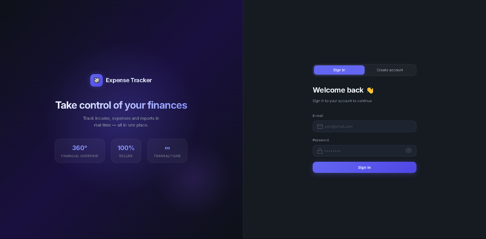
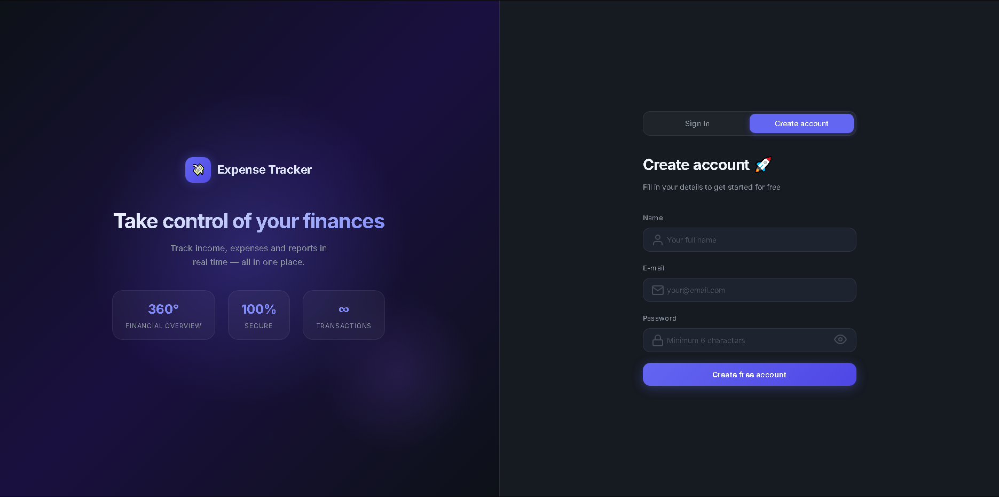
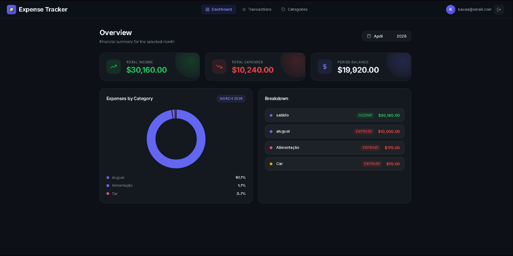
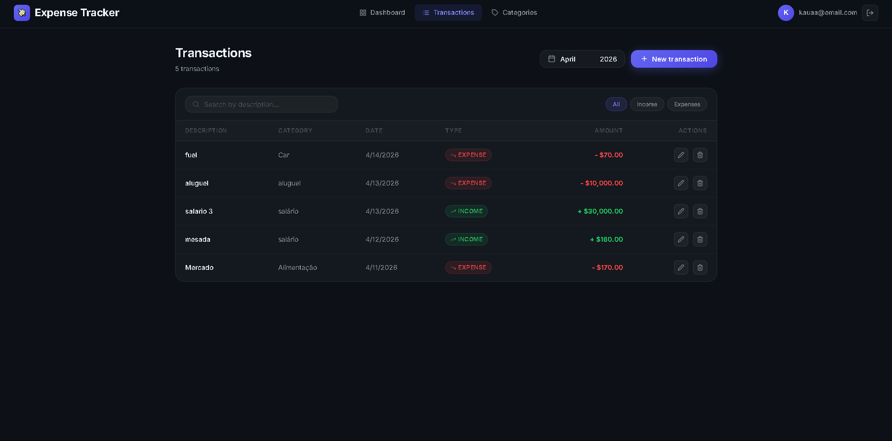
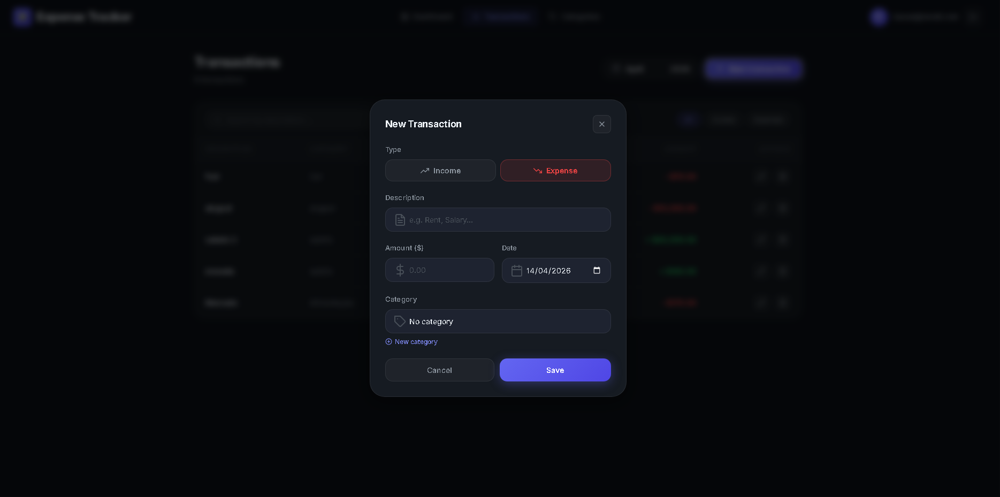
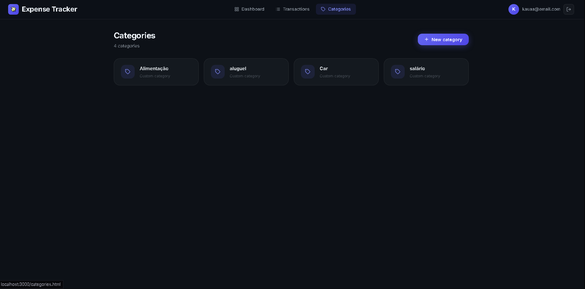
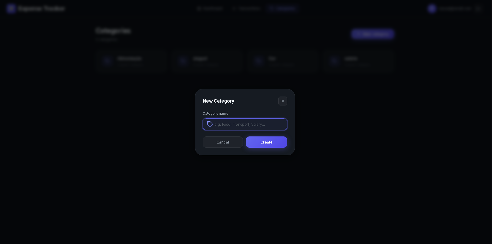

# Expense Tracker

A full-stack personal finance management application with a REST API backend and a responsive web frontend. Allows users to register income, expenses, and categories, and visualize spending reports with charts.

## Technologies

- Node.js
- Express
- PostgreSQL
- JWT (authentication)
- bcrypt (password encryption)
- Chart.js (frontend charts)
- Vanilla HTML/CSS/JavaScript (frontend)

## Features

- 🔐 **JWT Authentication** — Secure register and login with token-based auth
- 💸 **Expense & Income Tracking** — Record and manage transactions with descriptions, amounts, dates and categories
- 🗂️ **Category Management** — Create and organize custom spending categories per user
- 📊 **Financial Reports with Charts** — Visual dashboard with income/expense summary cards and a doughnut chart showing spending by category
- 🌙 **Responsive Frontend with Dark Mode** — Glassmorphism UI with full mobile support, accessible via browser at `http://localhost:3000`

## Screenshots









## Getting Started

### Prerequisites
- Node.js installed
- PostgreSQL installed

### Installation

```bash
git clone https://github.com/your-username/expense-tracker.git
cd expense-tracker
npm install
```

### Database Setup

Create a database called `expense_tracker` in PostgreSQL and run the following script:

```sql
CREATE TABLE users (
  id SERIAL PRIMARY KEY,
  name VARCHAR(100) NOT NULL,
  email VARCHAR(150) UNIQUE NOT NULL,
  password VARCHAR(255) NOT NULL,
  created_at TIMESTAMP DEFAULT NOW()
);

CREATE TABLE categories (
  id SERIAL PRIMARY KEY,
  name VARCHAR(100) NOT NULL,
  user_id INTEGER REFERENCES users(id) ON DELETE CASCADE,
  created_at TIMESTAMP DEFAULT NOW()
);

CREATE TABLE transactions (
  id SERIAL PRIMARY KEY,
  description VARCHAR(255) NOT NULL,
  amount DECIMAL(10,2) NOT NULL,
  type VARCHAR(10) CHECK (type IN ('receita', 'despesa')) NOT NULL,
  date DATE NOT NULL,
  user_id INTEGER REFERENCES users(id) ON DELETE CASCADE,
  category_id INTEGER REFERENCES categories(id) ON DELETE SET NULL,
  created_at TIMESTAMP DEFAULT NOW()
);

CREATE TABLE budgets (
  id SERIAL PRIMARY KEY,
  amount DECIMAL(10,2) NOT NULL,
  month VARCHAR(7) NOT NULL,
  user_id INTEGER REFERENCES users(id) ON DELETE CASCADE,
  category_id INTEGER REFERENCES categories(id) ON DELETE CASCADE,
  created_at TIMESTAMP DEFAULT NOW()
);
```

### Environment Variables

Create a `.env` file in the root of the project:

```env
PORT=3000
DB_HOST=localhost
DB_PORT=5432
DB_NAME=expense_tracker
DB_USER=postgres
DB_PASSWORD=your_password
JWT_SECRET=your_secret_key
```

### Running the Server

```bash
node src/index.js
```

Once the server is running, open your browser and navigate to:

```
http://localhost:3000
```

You will be greeted by the login page. Register an account to get started.

## API Routes

### Authentication
| Method | Route | Description |
|--------|-------|-------------|
| POST | /auth/register | Register a new user |
| POST | /auth/login | Login and get token |

### Categories (requires token)
| Method | Route | Description |
|--------|-------|-------------|
| GET | /categories | List all categories |
| POST | /categories | Create a category |
| DELETE | /categories/:id | Delete a category |

### Transactions (requires token)
| Method | Route | Description |
|--------|-------|-------------|
| GET | /transactions | List all transactions |
| GET | /transactions?mes=2026-04 | Filter by month |
| GET | /transactions?category_id=1 | Filter by category |
| POST | /transactions | Create a transaction |
| PUT | /transactions/:id | Update a transaction |
| DELETE | /transactions/:id | Delete a transaction |

### Reports (requires token)
| Method | Route | Description |
|--------|-------|-------------|
| GET | /reports/summary | General summary |
| GET | /reports/summary?mes=2026-04 | Summary by month |
| GET | /reports/by-category | Spending by category |